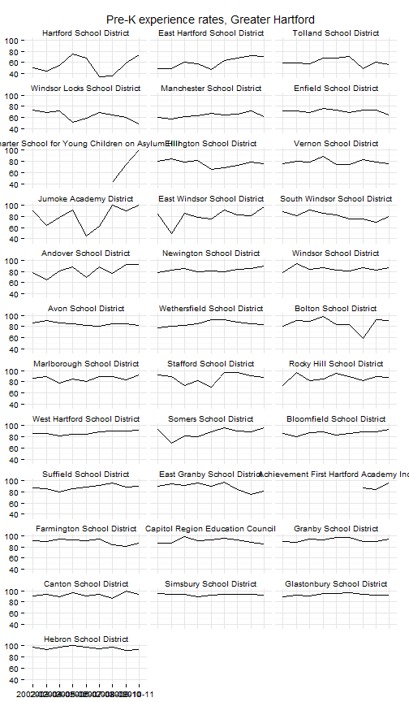
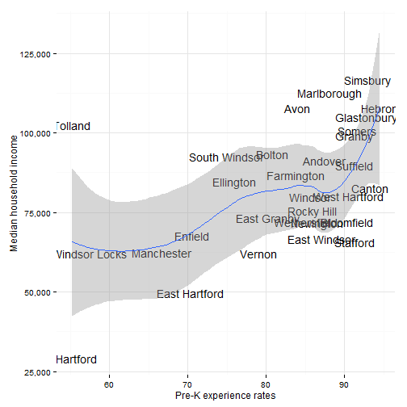
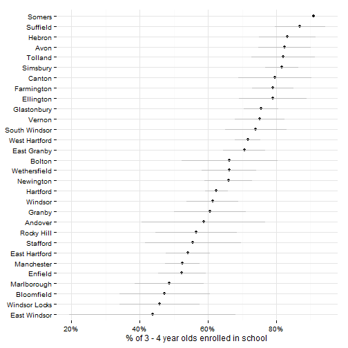

## Early childhood care and education indicators

Two indicators related to early childhood care and education ranked highly in the group survey: 
* % 3-4 yr. olds in Head Start or other pre-school
* Subsidized childcare slots/1,000 children age 3-5
Both are covered in this review. 

## Data and limitations

Two main sources provide population data on early care and education: 

* The Census provides data on school enrollment through the American Community Survey (ACS). The ACS data is grouped by [age, race, type and level of school](http://factfinder2.census.gov/faces/tableservices/jsf/pages/productview.xhtml?pid=ACS_11_5YR_B14003&prodType=table), but is only available for towns in this region for a rolling 3 to 5 year period.
* The State Department of Education (SDE) provides [data on pre-K experience and enrollment](http://sdeportal.ct.gov/Cedar/WEB/ct_report/PreKDT.aspx), along with data publicly-funded pre-K slots and data on kindergarten-readiness from the kindergarten inventory (KEI). 

The Department of Social Services (DSS) also provides data on subsidies, such as Care4Kids, that are targeted at early childhood. 

These sources ask different questions and tell somewhat different stories about pre-K experience in the Hartford region. 

## What do we already know?

Below are references for some local, regional and national reports that use data on early care and education. 

### Local

* [CT Kids Report Card](http://www.cga.ct.gov/kid/rba/results.asp) includes 'kindergarteners needing substantial help in school' as an indicator, using data from the SDE.
* [Health Equity Index](http://www.cadh.org/health-equity/health-equity-index.html) includes the percent of kindergarten students with pre-kindergarten educational experience.
* [Pioneer Valley State of the People](http://pvpc.org/resources/datastats/state-of-people/stateofthepeople2013.pdf) includes early education enrollment within their 'Education' domain. 
* [Data Haven's Community Well-Being Index](http://www.ctdatahaven.org/communityindex) includes the '% of children age 3-4 enrolled in preschool' as an indicator, using data from  the 2011 American Community Survey 5-year estimates on school enrollment. The report also uses data on the Kindergarten Inventory from SDE to assess school-readiness. 
* [Sustainable Knowledge Corridor Dashboard](http://www.sustainableknowledgecorridor.org/site/content/how-are-we-doing) includes 'Early education enrollment' from the American Community Survey.
* [Opportunities Hartford](http://www.cahs.org/programs-opportunitieshartford.asp) includes the number of children receiving Care4Kids subsidies under Early Care and Education. 
* [KidsCount](http://www.cahs.org/kidscount.asp) includes data on Care 4 Kids Child Enrollment from DSS and data on Pre-Kindergarten experience from SDE. 

### Other relevant efforts

* [The Child Well-Being Index](http://fcd-us.org/our-work/child-well-being-index-cwi) includes the rate of pre-kindergarten enrollment from national census data. 

## Sample results

### SDE: Enrollment data for pre-K programs

The following results review data on pre-K experience from the available sources. 

First, SDE provides data on the pre-K experience of students that enroll in kindergarten in the state. 

Aggregated data for the 30-town CRCOG region shows that roughly 75 percent of students enrolling in kindergarten have had some form of pre-K experience for the past few years. 

 

Segmenting districts, the rates of pre-K experience are lower in the eight Alliance Districts, fluctuating between 50 to 75 percent, while higher-performing districts have had rates closer to 85 percent.

 

Most districts have fairly stable rates, although there are large year-on-year fluctuations in the SDE data for Hartford Public Schools and declining rates in some other districts. 

 

Tolland Public Schools have the lowest rate of students with pre-K experience in the region. This is perhaps surprising given that it is among the higher-performing districts and more affluent towns in the region. 

 

Towns like Tolland are outliers if we compare median household income and rates of pre-K experience. The general trend is still for higher rates of pre-K experience in higher income towns.

 

### ACS: Enrollment data for pre-K programs

The second primary data source on early education is the American Community Survey. The ACS includes data on school enrollment (public and private), [segmented by age, gender and other variables](http://factfinder2.census.gov/faces/tableservices/jsf/pages/productview.xhtml?pid=ACS_12_1YR_B14003&prodType=table). 

The map below shows the percent of 3-4 year olds that were enrolled in public and private school programs, by town, for the five-year 2007 - 2011 period.

 

ACS results differ from the SDE results. Tolland (for instance) has one of the highest rates of pre-K enrollment in the ACS data, while it is among the lowest in the SDE data. Hartford is closer to the middle of the pack according to the ACS data, while Hartford Public Schools has among the lowest rates in the region according to the SDE data. According to the ACS data, urban periphery towns like East Windsor, Windsor Locks and Bloomfield have the lowest rates of enrollment in the region.

Since the data is drawn from the ACS, there are also margins of error associated with the values, which can be large for small towns. The grey bars illustrate the margin of error for each town. 

 

Direct comparison of ACS and SDE data shows where the 5-year average rates from both disagree. In general, the ACS data reports lower rates of enrollment than the SDE data. 

Each measures slightly different things - the ACS data measures the number of 3 - 4 year olds living in a town that attend some kind of school program. The SDE data measures the number of children, by district, attending kindergarten that have some prior pre-kindergarten experience. 

 

### Subsidies for pre-K programs

The next set of indicators are on subsidies for pre-K and other childcare programs. 

SDE publishes data on publicly-funded pre-K slots. Not all towns have available slots, but for those with slots, Bloomfield has the highest rate relative to the size of the 3 - 4 year-old population in the region. 

 

The publicly-funded childcare slots are also available by funding source and with several demographic breakouts. 

Care 4 Kids data is also available in [the most recent KidsCount report](http://www.cahs.org/pdf/CAHS2013-KIDSCOUNT-ALLPGS-SINGLES.pdf). The report notes that there are 'no surprises' - urban centers have higher enrollment, although some inner-ring suburbs also have high enrollment rates. 

In this case, Hartford has the highest rate in the region, followed by Bloomfield and East Hartford where the average number enrolled is more than half of all 3 - 4 year olds living in the town. 

 

