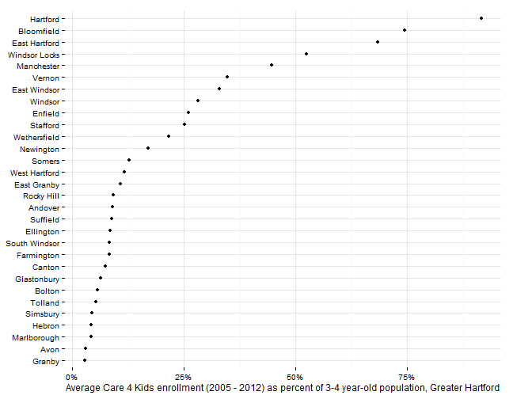

## Early childhood care and education indicators

Indicators related to childcare, pre-K experience and school readiness. This review combines two indicators that did well in the survey: 
* % 3-4 yr. olds in Head Start or other pre-school
* Subsidized childcare slots/1,000 children age 3-5

## Data and limitations

Different data on early care and education is available from a variety of sources. 

* The Census provides data on school enrollment through the American Community Survey (ACS). The ACS data is grouped by [age, race, type and level of school](http://factfinder2.census.gov/faces/tableservices/jsf/pages/productview.xhtml?pid=ACS_11_5YR_B14003&prodType=table), but is only available for small geographies over a rolling 3 to 5 year period.
* The State Department of Education (SDE) provides data on pre-K experience and enrollment, along with data publicly-funded pre-K slots and data on kindergarten-readiness from the kindergarten inventory (KEI). 
* The Department of Social Services (DSS) provides data on subsidies, such as Care4Kids, that are targeted at early childhood. 

## What do we already know?

Below are references for some local, regional and national reports that use data on early care and education. 

### Local

* [CT Kids Report Card](http://www.cga.ct.gov/kid/rba/results.asp) includes 'kindergarteners needing substantial help in school' as an indicator, using data from the SDE.
* [Health Equity Index](http://www.cadh.org/health-equity/health-equity-index.html) includes the percent of kindergarten students with pre-kindergarten educational experience.
* [Pioneer Valley State of the People](http://pvpc.org/resources/datastats/state-of-people/stateofthepeople2013.pdf) includes early education enrollment within their 'Education' domain. 
* [Data Haven's Community Well-Being Index](http://www.ctdatahaven.org/communityindex) includes the '% of children age 3-4 enrolled in preschool' as an indicator, using data from  the 2011 5-year American Community Survey estimates on school enrollment by age, along with data on the Kindergarten Inventory from SDE to assess school-readiness. 
* [Sustainable Knowledge Corridor Dashboard](http://www.sustainableknowledgecorridor.org/site/content/how-are-we-doing) includes 'Early education enrollment' from the American Community Survey.
* [Opportunities Hartford](http://www.cahs.org/programs-opportunitieshartford.asp) includes the number of children receiving Care4Kids subsidies under Early Care and Education. 
* [KidsCount](http://www.cahs.org/kidscount.asp) includes data on Care 4 Kids Child Enrollment from DSS and data on Pre-Kindergarten experience from SDE. 

### Other relevant efforts

* [The Child Well-Being Index](http://fcd-us.org/our-work/child-well-being-index-cwi) includes the rate of pre-kindergarten enrollment from national census data. 

## Sample results

For individual towns with data available, we can look at health insurance coverage with a few demographic breakouts. First, coverage rates by gender - coverage appears lower among males in all towns, with the lowest rates in Hartford and East Hartford. 

 

Pre-K rates for alliance district

 

Pre-K rates by town

 

If we look at the last five years, Tolland has the lowest rates of students with pre-K experience. 

 

While towns like Tolland are outliers, the general trend is still for higher rates of pre-K experience in higher income towns. 

 

Subsidized childcare slots

 

The subsidized childcare slots are also available by funding source and with several demographic breakouts. 

Care 4 Kids data is available in [the most recent KidsCount report](http://www.cahs.org/pdf/CAHS2013-KIDSCOUNT-ALLPGS-SINGLES.pdf). The report notes that there are 'no surprises' - urban centers have higher enrollment, although some inner-ring suburbs also have high enrollment rates. 

 

Look at per capita after loading population data from census. 

 

Since the data is drawn from the ACS, there are margins of error associated with the values, which can be large for small towns.  

For this data, the results are different. Tolland has one of the highest rates, and Hartford is closer to the middle of the pack. Rates are generally lower than as reported to SDE. 

 

Direct comparison shows the ACS and SDE data; both are 5 year averages. Which data is better? They measure slightly different things - the ACS data measures the number of 3 - 4 year olds living in these towns that attend school. The SDE data measures the number of children attending kindergarten in the respective school districts that have some prior pre-kindergarten experience. 

 

